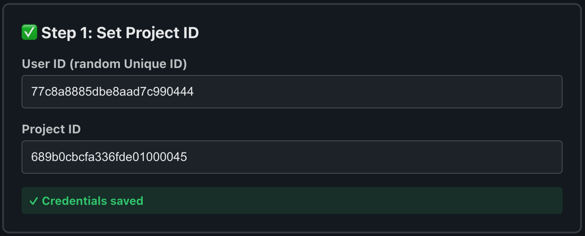
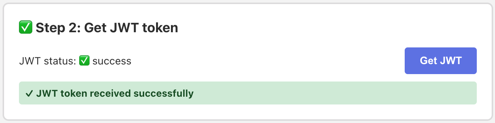
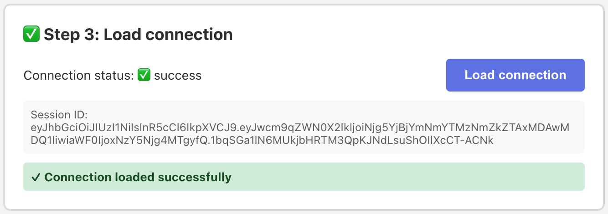
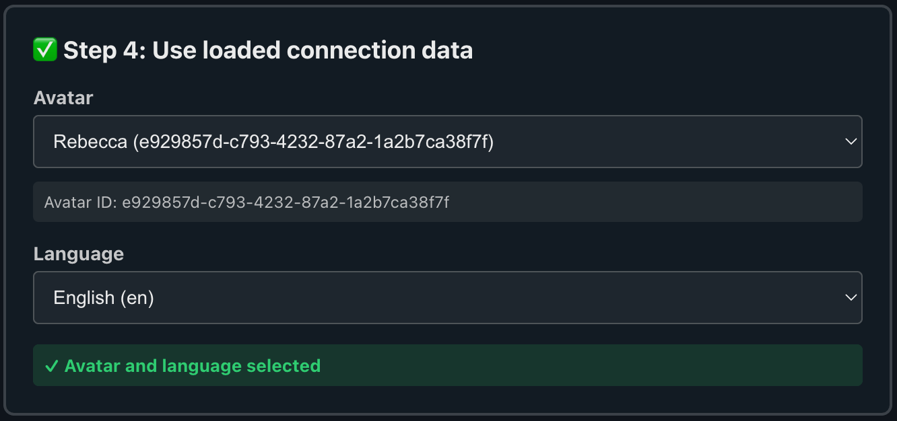
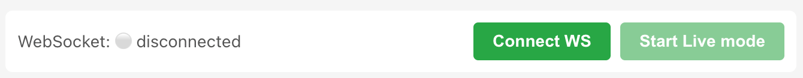
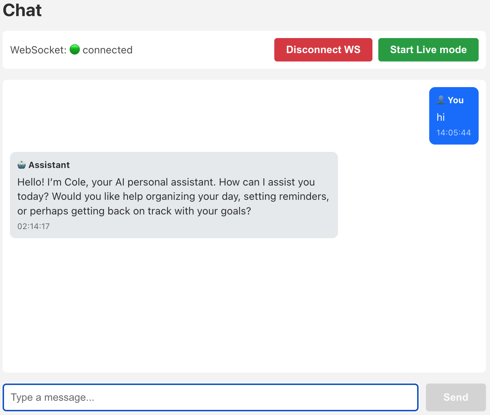
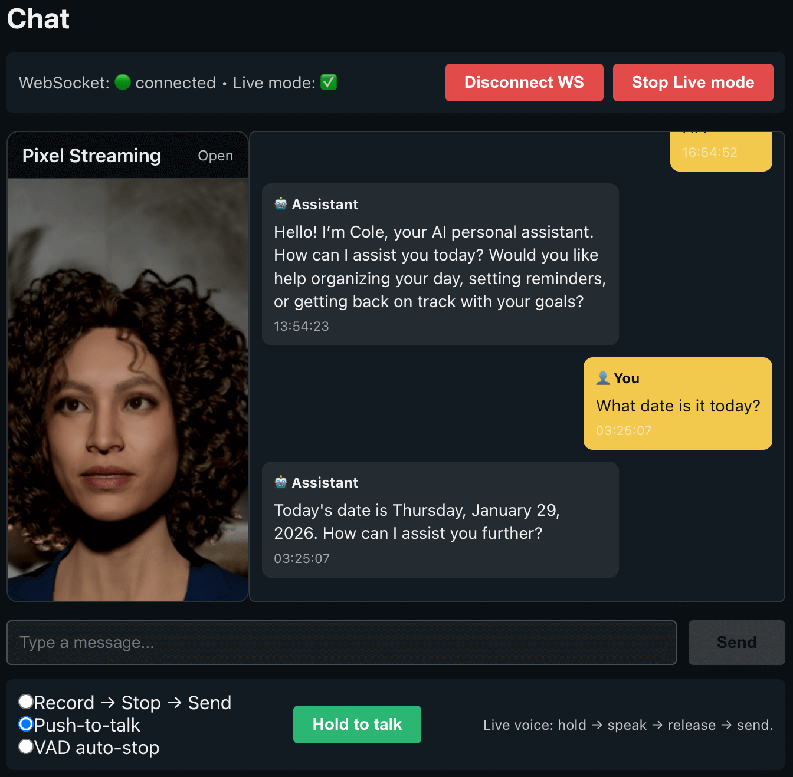

# RAVATAR API Demo

Public demo application showcasing how to integrate the **RAVATAR API**.

## 📘 API Documentation

- **RAVATAR API Guide (PDF):** https://cdn.rvtr.ai/images/ravatar-api-guide.pdf

## 📋 Prerequisites

- **Node.js**: v20+
- **Yarn**: v1.22+

## 🛠️ Installation

1. **Clone the repository**:

```bash
git clone https://github.com/RAVATAR-AI/rvtr-api-demo.git
cd rvtr-api-demo
```

2. **Install dependencies** (using Yarn only):

```bash
yarn install
```

## 🎯 Usage

### Development Mode

Start the development server:

```bash
yarn dev
```

The application will be available at `http://localhost:5173`

## 📖 How to run the demo (step by step)

Follow these steps to use the RAVATAR API Demo:

### Step 1: Configure API



1. Open the application in your browser
2. Go to the **Settings** tab (⚙️)
3. Enter your **RAVATAR Project ID**

### Step 2: Get JWT Token



1. Click the **"Get JWT"** button
2. Wait for the JWT token to be retrieved
3. Status will show ✅ success when complete

### Step 3: Load Connection Data



1. Click the **"Load Connection"** button
2. Status will show ✅ success when complete

### Step 4: Use loaded connection data (Avatar & Language)



1. Selections are automatically saved

### Step 5: Connect WebSocket




1. Switch to the **Chat** tab (💬)
2. Click the **"Connect WS"** button
3. Wait for WebSocket connection to establish
4. Status will show 🟢 connected when ready

### Step 6: Start Chatting



1. Type your message in the input field
2. Press **Enter** or click **"Send"**
3. View assistant responses in the message list

### Step 7: Live Mode (3D Avatar + Voice Interaction)



Live Mode allows you to interact with a real-time **3D avatar** using **voice** via Pixel Streaming.

#### Live Mode flow

1. Make sure:
   - JWT token is received
   - Connection data is loaded
   - WebSocket is connected (🟢)

2. Click the **"Start Live"** button in the Chat panel.

3. The application calls:

   ```http
   POST /startLiveSession
   ```

   Response example:

   ```json
   {
     "LicenseId": "string",
     "streamingUrl": "https://..."
   }
   ```

4. The returned `streamingUrl` is rendered inside an `iframe`.
   - This opens a Pixel Streaming session with a **3D avatar**
   - The avatar responds to **real-time voice input**
   - ⚠️ The `iframe` URL must include the JWT token obtained in **Step 2**

   Example:

   ```ts
   const sep = streamingUrl.includes("?") ? "&" : "?";
   const iframeUrl = `${streamingUrl}${sep}token=${encodeURIComponent(jwtToken)}`;
   ```

   This token is required for authentication inside the Pixel Streaming session.

5. You can now interact with the avatar using:
   - 🎙️ Voice Activity Detection (VAD)
   - 🎧 Push-to-talk
   - ⏺️ Record → Stop → Send

6. To stop Live Mode, click **"Stop Live"**
   - The application calls:
     ```http
     POST /endLiveSession
     ```
     using the returned `LicenseId`

#### Notes

- If the stream opens correctly in a new browser tab but shows a black screen inside the iframe, the Pixel Streaming page is likely blocking embeds via `X-Frame-Options` or CSP `frame-ancestors`.
- If your application is served over HTTPS, the `streamingUrl` must also use HTTPS. Mixed content is blocked by modern browsers.

## 🔧 Technical Details

### WebSocket Message Structure

**Outgoing Text Message**:

```typescript
{
  isLive: false,
  chat_type: "text",
  requestType: "text",
  avatar_id: string,
  user_id: string,
  language: string,
  request: string,
  source: string,
  session?: string
}
```

**Incoming Message**:

```typescript
{
  type: "connection" | "system" | "incoming" | "event",
  content?: string,
  message?: string,
  answer?: string,
  fileUrl?: string,
  file_base64_data?: string,
  timestamp?: string
}
```

### Live Mode (Pixel Streaming)

When Live Mode is enabled, the app can start a Pixel Streaming session via REST and then render the returned `streamingUrl` in an `iframe`.

**Endpoints**:

- `POST /startLiveSession` → returns `{ LicenseId, streamingUrl }`
- `POST /endLiveSession` → ends the session by `LicenseId`

**Common issue (black iframe)**:

- If `streamingUrl` works in a new tab but shows black in an `iframe`, the Pixel Streaming page is likely blocking embeds via `X-Frame-Options` or CSP `frame-ancestors`.
- If your app is served over HTTPS, an `http://` `streamingUrl` can be blocked by the browser (mixed content). Use HTTPS.

### Error Handling

The application handles the following HTTP status codes:

- **403 Forbidden**: Authentication failed, JWT expired or invalid
- **402 Payment Required**: Account balance or payment issue
- **503/504 Service Unavailable**: Automatic retry with exponential backoff (1s, 2s, 4s delays)

## 🐛 Troubleshooting

### "Failed to get JWT token"

- **Cause**: Invalid API URL or network issue
- **Solution**:
  - Verify your API URL
  - Check your internet connection

### "Failed to load connection"

- **Cause**: JWT token expired or invalid
- **Solution**:
  - Click "Get JWT" again to refresh the token
  - Ensure you got JWT successfully before loading connection

### WebSocket connection fails

- **Cause**: Invalid JWT token or WebSocket URL
- **Solution**:
  - Ensure JWT token is valid (refresh if needed)
  - Check browser console for WebSocket errors

### "Payment required" error (402)

- **Cause**: Account has insufficient balance or payment issue
- **Solution**: Check your RAVATAR account balance and payment status

### Messages not sending

- **Cause**: WebSocket not connected or missing required fields
- **Solution**:
  - Ensure WebSocket status shows 🟢 connected
  - Verify avatar and language are selected in Settings
  - Check browser console for errors

### Pixel Streaming iframe shows a black screen

- Click the **Open** link (new tab). If it works there but not in the iframe, check DevTools Console for `X-Frame-Options` / `frame-ancestors` errors (server-side change required).
- If the app is HTTPS, ensure the `streamingUrl` is also HTTPS (mixed content is blocked).

## 📝 License

MIT

## 🤝 Contributing

Contributions are welcome! Please ensure:

- Use Yarn (not npm) for package management
- Follow existing TypeScript patterns
- Maintain strict type safety
- Add appropriate error handling
- Update documentation for new features
